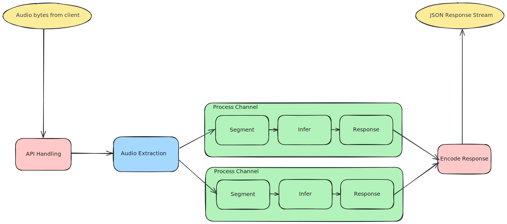

# Introduction

It is a truth universally acknowledged, that a single developer in possession
of a good audio processing model, must be in want of a streaming API. Maybe
not universally acknowledged but it's definitely a common request at my place
of work, both interally and externally.

The existence of the ability to make some observation about audio often leads
people to want to do this on a live audio stream. We can see this in live
transcription in any meeting applications, existing video is easier we can
process it offline. But live, dynamic and non-scripted audio require completely
different solutions and trade-offs.

In this project I'm not going to provide a model or a solution, those can be
found elsewhere. What I will provide however is a general approach to create
streaming services where audio is streamed in and observations streamed out.

Initially, I'm just doing this with websockets, but in future gRPC may be
considered. And maybe even SSE or HTTP/2 streams (who knows).

Without further ado the system.

## The System

Here I've generally split the system into 3 different concerns:

1. The API received data and forwarding it to tasks, receiving results back and sending them back
2. Audio processing - extracting samples and transcoding to a format our model expects
3. The model itself - some simple segmentation and dealing with blocking inference calls

I've coloured these, and we can get a clue on how data flows through the system.
Raw bytes and some API messages will come via the API input. The audio
extraction with get the audio into a form our model can work with and then our
model observations will be turned into something like JSON
for the client to handle.

As I go deeper into different parts these will be explored at greater and
greater depth as well as some common tropes of this genre of system. Well
tropes at least as far as I've experienced, mainly Speech To Text (STT)
systems - sometimes called Automatic Speech Recognition (ASR).

This project makes a lot of use of the actor model and tokio channels because
they are very convenient. There will be occasional performance tips and tricks,
as well as testing and various parts of the ecosystem. I'll try and fill in
a bit of knowledge regarding the engineering concerns of such systems.

## What Currently Exists?

Currently, I do have an actual system, with Voice Activity Detection (VAD)
based segmentation. Some performance metrics, Opentelemetry traces and a 
dummy model that counts the number of samples with an `thread::sleep`
call added so we can pretend we're a big slow Machine Learning (ML) model.

I haven't wrote about all these components, tested them or refined them so
careful if you poke around the code because here be dragons.

If this sounds interesting keep and ear out more posts will drop in future
at indeterminable times.
