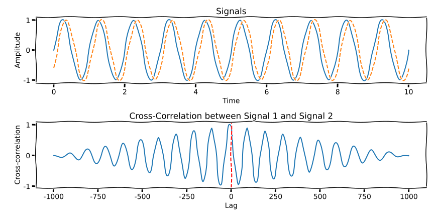

# Audio Decoding 

In the last entry, it was decided that the audio coming in would be PCM data
with a specified sample rate, channel count, and data type. This is quite
helpful, as we don't need to think about audio codecs and setting up decoders.
There is one thing we have to think of though: converting from the input sample
rate to our model's desired sample rate. 

Models typically only work on one sample rate. Rarely, you might see a model
take in 2 and do some basic resampling logic at the input. But in these cases
giving it the right sample rate first will cause the inference code to do less 
work so it's still preferable.

I also said previously we'd be using the actor model, if you're not familiar
there's this blog post by Alice Rhyl
[actors with tokio](https://ryhl.io/blog/actors-with-tokio/).

The input to the function will be a channel sending the encoding audio data,
we'll already have the format info when we call it to keep things simpler. The
output will be decoded samples sent down a tokio channel specific to the
audio-channel.

I'll do my best to try and avoid audio-channel vs tokio channel confusion,
but please leave feedback if it's ambiguous anywhere. The terminology overlap
is a real pain at times!

```rust
use tokio::sync::mpsc;
use crate::api_types::AudioFormat;
use bytes::Bytes;

pub async fn decode_audio(
    audio_format: AudioFormat,
    mut rx: mpsc::Receiver<Bytes>,
    channel_data_tx: Vec<mpsc::Sender<Vec<f32>>>,
) -> anyhow::Result<()> {
    todo!()
}
```

To recap the `AudioFormat` type is:

```rust
/// Describes the PCM samples coming in. I could have gone for an enum instead of bit_depth +
/// is_float but I only really plan on doing f32, s16 and ignoring everything else including
/// compression schemes like mulaw etc. This may change in future.
#[derive(Copy, Clone, Debug, Eq, PartialEq, Serialize, Deserialize)]
pub struct AudioFormat {
    /// Number of channels in the audio
    pub channels: usize,
    /// Sample rate of the audio
    pub sample_rate: usize,
    /// Number of bits per sample
    pub bit_depth: u16,
    /// Whether audio uses floating point samples
    pub is_float: bool,
}
```

There are raw bytes coming in, potential of any width and we have floats coming
out. Better think about decoding those samples. For this I'll make a `Sample`
trait, it's likely an abstraction overkill but there is a potential to macro
generate this code later and reduce the amount of code we write and it's not
harmful.

```rust
trait Sample: Copy {
    fn to_float_samples(data: &[u8]) -> anyhow::Result<Vec<f32>>;

    fn to_float(self) -> f32;
}
```

Implementing this for `i16` would look like:

```rust
impl Sample for i16 {
    fn to_float_samples(data: &[u8]) -> anyhow::Result<Vec<f32>> {
        if data.len() % 2 != 0 {
            anyhow::bail!("Got a partial sample: {} bytes", data.len());
        }
        let samples = data
            .chunks(2)
            .map(|x| i16::from_le_bytes((&x[..2]).try_into().unwrap()))
            .map(|x| x.to_float())
            .collect();
        Ok(samples)
    }

    fn to_float(self) -> f32 {
        self as f32 / i16::MAX as f32
    }
}
```

To do this for `f32`, we change the `2` to `4`, `i16` to `f32` and make
`to_float` return self. Then we can remove the `map(|x| x.to_float())`. The
copy-paste-ability of this code makes generating it automatically in the
future potentially very nice.

To improve this you could have `to_float_samples` take in an output
buffer and reuse allocations. That can be an exercise for the reader (or a
future post). But generally speaking, this part of the code is always going
to be lightning fast compared to the model code so we'll hold off on optimising
this too much for now.

Initially, we'll just error out on any formats that aren't the correct sample
rate. This will help me keep things simpler initially. So with some initial
error checking, we have everything we need to do a first implementation:

```rust
pub async fn decode_audio(
    audio_format: AudioFormat,
    mut rx: mpsc::Receiver<Bytes>,
    channel_data_tx: Vec<mpsc::Sender<Vec<f32>>>,
) -> anyhow::Result<()> {
    if channel_data_tx.is_empty() {
        anyhow::bail!("No output sinks for channel data");
    }

    if audio_format.sample_rate != MODEL_SAMPLE_RATE {
        // No need to be more specific in message, we'll rewrite this later
        anyhow::bail!("Invalid sample rate provided");
    }    
    
    let mut received_samples = 0;
    let mut sent_samples = 0;

    let mut current_buffer = vec![];
    while let Some(data) = rx.recv().await {
        let mut samples = match (audio_format.bit_depth, audio_format.is_float) {
            (16, false) => i16::to_float_samples(&data),
            (32, true) => f32::to_float_samples(&data),
            (bd, float) => {
                anyhow::bail!("Unsupported format bit_depth: {} is_float: {}", bd, float)
            }
        }?;
        received_samples += samples.len();
        current_buffer.append(&mut samples);
        
        let mut channels = vec![
            Vec::with_capacity(current_buffer.len() / audio_format.channels);
            audio_format.channels
        ];
        for (chan, data) in (0..channel_data_tx.len())
            .cycle()
            .zip(current_buffer.drain(..))
        {
            channels[chan].push(data);
        }
        for (data, sink) in channels.drain(..).zip(&channel_data_tx) {
            sink.send(data).await?;
        }
    }
}
```

Looking at this there are probably a few questions. 

* Could we handle interleaving in the decoding side instead of an extra loop?
* Could we also not await on the channel send and fire off more futures quicker?

The answer to both of these is yes. 

However, considering the interleaving if you're using an existing library
like ffmpeg or maybe gstreamer to decode samples you often get your data
interleaved and then have to do this extra step anyway. For services with a
streaming and non-streaming mode where the non-streaming accepts any potential
file format having solid reusable audio code for both is pretty nice and that's
how it exists at my Day Job so that's what's replicated here.

For the second point, this might be done in the future, but this is "good enough".
At least there are potentially easy optimisations we can work on in future. Also, 
in the short-term we know our audio is coming through in the correct ordering and
once we have more testing infrastructure in place we can work on harder things.

## Resampling Audio

We'll be implementing our audio resampling via the [rubato](https://crates.io/crates/rubato) 
crate. It seems to be the most thorough crate and provides a few algorithms
and parameters to tweak them. And what is software if not the desire for an
abundance of knobs to twiddle? Unfortunately, making a choice of technique and
how to tune it involves a lot of maths. Because of this I'm going to try and
gloss over some of these details as going into this maths is a deep dive series
in it's own right.

The resamplers in Rubato are either synchronous or asynchronous, but this is
another collision of terminology between domains. An asynchronous resampler
allows you to adjust the resampling ratio while the resampler is running. This
could be useful for certain codecs or when using an audio
protocol that might adjust the sample rate based on the bandwidth available.

We're not going to change the sample rate so we don't have to worry
about this. But if you work on an application where this can happen you
should think about your maximum possible sample rate and the algorithm used.
Changing the sample rate can either be completely fine or change the 
aliasing effects in resampling so a wrong decision can increase the noise in
the output! Think about whether you'll be increasing or decreasing the sample rate
and how your resampler works.

Looking at Rubato our available types of resamplers are:

* "Fast" 
* Sinc
* FFT (Fast Fourier Transform)

Fast and Sinc are both asynchronous and FFT is a synchronous resampler. We can
use an asynchronous resampler like a synchronous one. I'll expand on the
reasons why later but for now just accept we're using a Sinc resampler. We'll 
also use a fixed input size resampler, this is because when batching up the input
we can more easily see when we hit the necessary input length than checking the
resampler on how many more input frames it desires. We can more easily wthin
the code trigger when we want to resample and emit our samples.

We'll create our resampler as follows:

```rust
fn create_resampler(audio_format: &AudioFormat, resampler_size: usize) -> anyhow::Result<SincFixedIn<f32>> {
    let window = WindowFunction::Blackman;
    let params = SincInterpolationParameters {
        sinc_len: 256,
        f_cutoff: calculate_cutoff(256, window),
        oversampling_factor: 128,
        interpolation: SincInterpolationType::Cubic,
        window,
    };
    // resample_ratio, max_resample_ratio_relative, params, input buffer size, channel count
    let resampler = SincFixedIn::new(
        MODEL_SAMPLE_RATE as f64 / audio_format.sample_rate as f64, 
        1.0,
        params,
        resampler_size,
        audio_format.channels,
    )?;

    trace!(
        input_frames_max = resampler.input_frames_max(),
        output_frames_max = resampler.output_frames_next(),
        "Resampler created"
    );
    Ok(resampler)
}
```

Most of these parameters come from the documentation or examples, which means
they should be a relatively good performance/quality tradeoff. Looking over
the docs parameters like window functions are explained and their impacts on
the output. As we don't plan on changing the sample rate the
`max_resample_ratio_relative` is set to 1.0.

Now we change our bailing on incorrect sample rates from:

```rust
if audio_format.sample_rate != MODEL_SAMPLE_RATE {
    // No need to be more specific in message, we'll rewrite this later
    anyhow::bail!("Invalid sample rate provided");
}    
```

Into:

```rust
const RESAMPLER_SIZE: usize = 4096;

let mut resampler = if audio_format.sample_rate != MODEL_SAMPLE_RATE {
    Some(create_resampler(&audio_format, RESAMPLER_SIZE)?)
} else {
    None
};
```

Our audio-receiving loop becomes a bit more complicated:
l
```rust
let resample_trigger_len = audio_format.channels * RESAMPLER_SIZE;
let mut current_buffer = Vec::with_capacity(resample_trigger_len);
while let Some(data) = rx.recv().await {
    // We could do the sample extraction and uninterleave the samples in one go. But if you're
    // using an existing library like ffmpeg (or maybe gstreamer) to decode and resample audio
    // you'll get the audio interleaved and have to split it out so you will get a similar
    // performance profile anyway.
    let mut samples = match (audio_format.bit_depth, audio_format.is_float) {
        (16, false) => i16::to_float_samples(&data),
        (32, true) => f32::to_float_samples(&data),
        (bd, float) => {
            anyhow::bail!("Unsupported format bit_depth: {} is_float: {}", bd, float)
        }
    }?;
    received_samples += samples.len();
    current_buffer.append(&mut samples);

    if current_buffer.len() >= resample_trigger_len || resampler.is_none() {
        let capacity = RESAMPLER_SIZE.min(current_buffer.len() / audio_format.channels);
        let mut channels = vec![Vec::with_capacity(RESAMPLER_SIZE); audio_format.channels];
        for (chan, data) in (0..channel_data_tx.len())
            .cycle()
            .zip(current_buffer.drain(..(capacity * audio_format.channels)))
        {
            channels[chan].push(data);
        }

        let mut channels = if let Some(resampler) = resampler.as_mut() {
            resampler.process(&channels, None)?
        } else {
            channels
        };

        for (data, sink) in channels.drain(..).zip(&channel_data_tx) {
            //trace!("Emitting {} samples for channel {}", data.len(), i);
            sent_samples += data.len();
            sink.send(data.into()).await?;
        }
    }
}
```

The changes here:

1. We accumulate our decoded samples into a buffer
2. When we have enough samples for the input we trigger a resampling
3. We make a `Vec<Vec<f32>>` for our de-interleaved input data
4. Pass it into the resampler if we need to resample, otherwise use it directly
5. Send the samples on

There's just one last thing we haven't yet considered, we need the full buffer
of samples to trigger a resampling. What if there's some leftover but not
enough for a full buffer?

The answer is to largely repeat the same resampling process but use
the `process_partial` function in the resampler to process an incomplete
buffer and then truncate the output to the correct length. After the
resampling loop, we fill in this code:

```rust
    if !current_buffer.is_empty() {
        trace!(
            "Sent out {} expected output {}",
            sent_samples,
            received_samples as f64 * resample_ratio
        );
        let new_len = if (sent_samples as f64) < received_samples as f64 * resample_ratio {
            let per_channel_sample = ((received_samples as f64 * resample_ratio)
                / audio_format.channels as f64)
                .round() as usize;
            Some(per_channel_sample - sent_samples)
        } else {
            None
        };
        let mut channels = vec![
            Vec::with_capacity(current_buffer.len() / audio_format.channels);
        audio_format.channels
    ];
    for (chan, data) in (0..channel_data_tx.len())
        .cycle()
        .zip(current_buffer.drain(..))
    {
        channels[chan].push(data);
    }
    let mut channels = if let Some(resampler) = resampler.as_mut() {
        resampler.process_partial(Some(&channels), None)?
    } else {
        channels
    };
    for (mut data, sink) in channels.drain(..).zip(&channel_data_tx) {
        if let Some(new_len) = new_len {
            trace!(
                "Downsizing to avoid trailing silence to {} bytes from {}",
                new_len,
                data.len()
            );
            data.resize(new_len, 0.0);
        }
        sink.send(data.into()).await?;
    }
}
```

## Testing It

The question now comes of how to test this. We want to make sure we're
resampling things relatively correctly. Given sample rates may not be
a factor of one another we can't easily figure out input and expected
output data. Additionally, some of the maths involved means there may be
aliasing effects within certain frequency ranges and an element of error.
So how do we get past this?

One of my preferred techniques is to bring in a crate called
[dasp](https://crates.io/crates/dasp) for digital audio signal processing.

Using dasp I can create a signal and alter things such as the sample rate
to create a "perfect" version of the signal at my input and output sample
rates and then compare them. Keeping things relatively simple with a sine
wave I can make a 1.6KHz sine wave sampled at 16KHz and grab 32000 samples
of it as follows:

```rust
let expected_output = signal::rate(16000.0)
    .const_hz(1600.0)
    .sine()
    .take(32000)
    .map(|x| x as f32)
    .collect::<Vec<f32>>();
```

Another thing is resamplers can add noise and amplify or suppress certain components
in the signal. They may also impact the phase of the signal. This is why
the FFT resampler and fast resampler weren't chosen. Using the test metric I
picked they scored poorly and also doing a direct comparison to the
expected dasp output doesn't work.

To test the signal is as expected a metric called cross-correlation is used.
And while I vaguely know the maths and can find it in some of my uni notes I
wanted to lean on an existing "golden" implementation for discrete instead of
continuous time. So using [this source](https://paulbourke.net/miscellaneous/correlate/)
we have this function to measure the similarity of two signals:

```rust
fn xcorr(a: &[f32], b: &[f32]) -> f32 {
    let mean_a = a.iter().sum::<f32>() / a.len() as f32;
    let mean_b = b.iter().sum::<f32>() / b.len() as f32;

    let num = a
        .iter()
        .zip(b.iter())
        .map(|(a, b)| (a - mean_a) * (b - mean_b))
        .sum::<f32>();
    let dn_a = a.iter().map(|x| (x - mean_a).powi(2)).sum::<f32>().sqrt();
    let dn_b = b.iter().map(|x| (x - mean_b).powi(2)).sum::<f32>().sqrt();

    num / (dn_a * dn_b)
}
```

The xcorr function I've provided doesn't let you apply a lag or delay to the
signals. We can look how how cross-correlation output appears for two similar
but slightly delayed sine waves below:



At lag 0, this is the value the function should output, the higher the more similar
they are. Comparing this to a 180° phase shift the signal scores very poorly:


This is better than the very unreliable comparison of each sample and a rougher
root-mean-square error or energy calculation which may not work well for changes
with no perceptual impact i.e. slight phase offsets. While the xcorr method won't
work for big phase changes small changes can still score reliably above a certain
threshold we decide upon.

Our inputs are a stream of bytes and the `AudioFormat` type and the outputs can be
grabbed as a `Vec<Vec<f32>>`. Using this a `test_audio` function can be created
that all the tests can utilise:

```rust
async fn test_audio(
    format: AudioFormat,
    mut input: BytesMut,
    chunk_size: usize,
    expected: Vec<Vec<f32>>,
    output_name: &str,
) {
    let (bytes_tx, bytes_rx) = mpsc::channel(8);

    let mut output_channels = vec![];
    let mut incoming_samples = FuturesOrdered::new();
    for _ in 0..format.channels {
        let (sample_tx, mut sample_rx) = mpsc::channel::<AudioChannel>(8);
        output_channels.push(sample_tx);
        incoming_samples.push_back(async move {
            let mut resampled: Vec<f32> = vec![];
            while let Some(samples) = sample_rx.recv().await {
                resampled.extend_from_slice(&samples);
            }
            resampled
        });
    }

    let decoder = tokio::spawn(decode_audio(format, bytes_rx, output_channels));

    let handle = tokio::spawn(async move {
        while !input.is_empty() {
            let to_send = if input.remaining() > chunk_size {
                input.split_to(chunk_size)
            } else {
                input.split()
            };
            bytes_tx.send(to_send.freeze()).await.unwrap();
        }
    });

    let resampled = incoming_samples.collect::<Vec<_>>().await;

    let expected_name = format!("{}_expected.wav", output_name);
    let actual_name = format!("{}_actual.wav", output_name);
    write_wav(&expected_name, &expected);
    write_wav(&actual_name, &resampled);

    decoder.await.unwrap().unwrap();
    handle.await.unwrap();

    // Save our files for debugging

    for (channel_index, (expected_channel, actual_channel)) in
        expected.iter().zip(resampled.iter()).enumerate()
    {
        let similarity = xcorr(&expected_channel, &actual_channel);
        println!(
            "Channel {} cross correlation is {}",
            channel_index, similarity
        );
        assert!(similarity > 0.95);
    }

    let _ = fs::remove_file(&expected_name);
    let _ = fs::remove_file(&actual_name);
}
```

The file is saved and at the end of the function deleted. Therefore,
if a test fails we have the expected and actual outputs as audio files
that can be inspected in Audacity or a similar waveform viewer to figure
out what went wrong. With these building blocks in place, a test can be
written as so:

```rust
#[tokio::test]
#[traced_test]
async fn upsample_s16_audio() {
    let format = AudioFormat {
        sample_rate: 8000,
        channels: 1,
        bit_depth: 16,
        is_float: false,
    };

    let expected_output = signal::rate(16000.0)
        .const_hz(800.0)
        .sine()
        .take(64000)
        .map(|x| x as f32)
        .collect::<Vec<f32>>();

    let input = signal::rate(8000.0)
        .const_hz(800.0)
        .sine()
        .take(32000)
        .map(|x| x as f32)
        .flat_map(|x| ((x * i16::MAX as f32) as i16).to_le_bytes())
        .collect::<BytesMut>();

    test_audio(format, input, 300, vec![expected_output], "upsample_s16").await;
}
```

I'm using [tracing-test](https://crates.io/crates/tracing-test) to enable tracing
logs in tests for cases on if things fail. If people can see their logs appear
when tests fail it makes them less likely to sneak in debug print statements
that pass through PR review.

Once this was done and the testing approach validated I filled in a few extra
tests covering:

1. Upsampling - increasing the sample rate
2. Downsampling - decreasing the sample rate
3. Passthrough - sample rate is unchanged
4. Mono and stereo audio data
5. Some variations on chunk sizes to ensure there are remainders left

With all of this done, it looks like testing is complete!

## Final Thoughts

The world of signal processing is hard and full of maths, and maybe better ways
of testing resampled audio for correctness exists. In my experience
cross-correlation has addressed a number of shortcomings with other methods and
when validating the approach I've not seen any samples rejected that should have
been accepted. But if anyone has better approaches I'd be interested in hearing
about them.

For different resamplers a different testing strategy has to be considered,
comparing resampled audio can be unreasonably hard! Resamplers can do all manner
of things to make audio try to sound better or run faster. An example is some
resampling algorithms utilise dithering (application of low altitude noise).
When decreasing the fidelity of audio dithering can reduce the presence
of quantisation noise and the audio equivalent of JPEG blocking artefacts.

Additionally, while upsampling is being allowed in this project, you may want to
deny users that ability. If you have models that are trained on audio of a
specific quality accepting audio of a lower quality will often result in lower
accuracy. In my experience the previously mentioned product manager will have
to make the call on whether to accept any input or prevent the users giving
input that makes your product look bad. More likely, they'll just ask you if
you can make it perform with equal accuracy on any inputs. So good luck!
